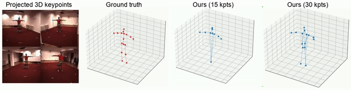

# BKinD-3D: Self-Supervised 3D Keypoint Discovery from Multi-View Videos

Implementation from the paper:
> Jennifer J. Sun*, Lili Karashchuk*, Amil Dravid*, Serim Ryou, Sonia Fereidooni, John C. Tuthill, Aggelos Katsaggelos, Bingni W. Brunton, Georgia Gkioxari, Ann Kennedy, Yisong Yue, Pietro Perona,
 [BKinD-3D: Self-Supervised 3D Keypoint Discovery from Multi-View Videos](https://arxiv.org/abs/2212.07401). In Conference on Computer Vision and Pattern Recognition (CVPR), 2023


BKinD-3D discovers keypoints in 3D from multi-view behavioral videos without any keypoint or bounding box supervision in 2D or 3D. It works on a range of organisms including rats and humans. The discovered keypoints and additional shape features are directly applicable to downstream tasks including behavior classification and pose regression!

<p align="center"></p>

# Set up environment
0. We provided an environment file vol3d_env.yml for running our train & evaluation code

# How to set up data for human experiments
1. Download Human 3.6M dataset: http://vision.imar.ro/human3.6m/description.php
   (Ask for permission to authors)
2. Extract frames from video to data/H36M 
   - Our implementation uses this code (https://github.com/anibali/h36m-fetch) for frame extraction
   - Dataloader for h36m has to be updated if you extract frames using different code. 
3. Run command

python train_video_multiview.py --config config/H36M.yaml
   
This will take 1~2 days on a single GPU.   


# Evaluation
1. Once you are done with training keypoint discovery model, evaluate 3D pose regression task on the Human 3.6M dataset using code in the evaluation folder
2. Run command

python evaluation/evaluate.py --config config/H36M.yaml
    
This will take 1~2 hours on a single GPU.

## License

Please refer to our paper for details and consider citing it if you find the code useful:
```
@article{bkind-3d_2023,
  title = {{{BKinD-3D}}: {{Self-Supervised 3D Keypoint Discovery}} from {{Multi-View Videos}}},
  author = {Sun, Jennifer J. and Karashchuk, Lili and Dravid, Amil and Ryou, Serim and Fereidooni, Sonia and Tuthill, John and Katsaggelos, Aggelos and Brunton, Bingni W. and Gkioxari, Georgia and Kennedy, Ann and Yue, Yisong and Perona, Pietro},
  year = {2023},
  journal={arXiv preprint arXiv:2112.05121},
  doi = {10.48550/arXiv.2212.07401}
}

```

Our code is available under the [Apache License 2.0](https://www.apache.org/licenses/LICENSE-2.0).
